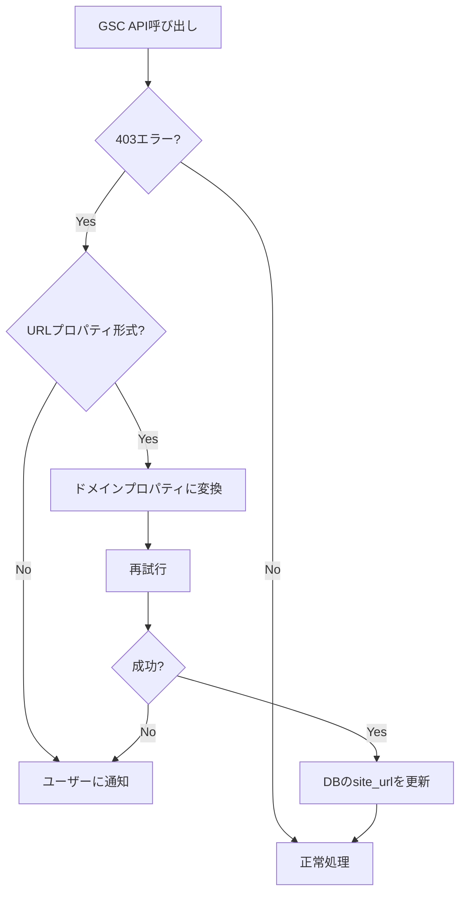

# GSC サイトURL処理設計書

## 概要

Google Search Console（GSC）には2種類のプロパティ形式があり、ReRank AIがこれらを正しく処理する必要があります。本ドキュメントでは、全パターンの整理と包括的な解決策を記載します。

## GSCプロパティの種類

### 1. ドメインプロパティ（Domain Property）
- **形式**: `sc-domain:example.com`
- **特徴**: ドメイン全体（サブドメイン含む）をカバー
- **認証方法**: DNSレコードのみ

### 2. URLプレフィックスプロパティ（URL Prefix Property）
- **形式**: `https://example.com/`
- **特徴**: 特定のURLパスをカバー
- **認証方法**: HTMLタグ、HTMLファイル、Google Analytics、Googleタグマネージャー、DNSレコード

---

## ユーザーの所有権確認パターン

| パターン | GSCでの設定 | DB保存形式 | GSC API用URL | クロール用URL |
|---------|------------|-----------|-------------|--------------|
| **A: ドメインプロパティ** | `sc-domain:example.com` で認証 | `sc-domain:example.com` | `sc-domain:example.com` | `https://example.com/` に変換 |
| **B: URLプレフィックス** | `https://example.com/` で認証 | `https://example.com/` | `https://example.com/` | そのまま使用 |
| **C: URLで登録したがドメインで認証済み** | `https://example.com/` で選択、でも認証は `sc-domain:` のみ | 現状: `https://example.com/` | **403エラー発生** → 自動変換必要 | 変換後の `sc-domain:` から `https://` に |

---

## 処理フロー別の要件

### 1. サイト保存時 (`/api/sites/save`)

#### 現在の処理
`lib/db/sites.ts` の `saveOrUpdateSite()` 関数が `normalizeSiteUrl()` を呼び出し、`sc-domain:example.com` → `https://example.com/` に変換してDBに保存。

```typescript
// lib/db/sites.ts 内
site_url: normalizedSiteUrl, // 正規化されたURLに更新
```

#### 問題点
ユーザーがドメインプロパティで認証している場合、DBには `https://` 形式で保存されるため、GSC APIで **403 Forbidden** エラーが発生する。

#### 理想的な解決策
DBにはユーザーが選択した形式をそのまま保存する（`sc-domain:` 形式も保持）。

---

### 2. GSC API呼び出し時 (`check-rank`, `articles/list`, etc.)

#### 現在の処理
- `lib/gsc-api.ts` で正しくURL形式を処理
  - `sc-domain:` → 末尾スラッシュなし
  - `https://` → 末尾スラッシュあり
- 403エラー時にURLプロパティ→ドメインプロパティへの自動変換

```typescript
// lib/gsc-api.ts 内
let normalizedSiteUrl: string;
if (siteUrl.startsWith("sc-domain:")) {
  // ドメインプロパティの場合、末尾のスラッシュを削除
  normalizedSiteUrl = siteUrl.replace(/\/$/, "");
} else {
  // URLプロパティの場合、末尾にスラッシュを追加
  normalizedSiteUrl = siteUrl.endsWith("/") ? siteUrl : `${siteUrl}/`;
}
```

#### 403エラー時の自動変換フロー



---

### 3. コンテンツクロール時

#### 現在の処理
`articles/list` や `competitor-analysis.ts` で `sc-domain:` を `https://` に変換してクロール。

```typescript
// articles/list/route.ts 内
if (site.site_url.startsWith("sc-domain:")) {
  const domain = site.site_url.replace("sc-domain:", "");
  fullUrl = pageUrl.startsWith("http")
    ? pageUrl
    : `https://${domain}${pageUrl.startsWith("/") ? pageUrl : `/${pageUrl}`}`;
}
```

#### ステータス
✅ 正しく処理されている

---

## 発見された問題点

### 問題1: サイト保存時のURL正規化

**現象**: ユーザーが `sc-domain:example.com` を選択しても、`https://example.com/` 形式でDBに保存される。

**影響**: GSC API呼び出し時に403エラーが発生し、毎回自動変換が必要になる。

**該当コード**:
```typescript
// lib/db/sites.ts の saveOrUpdateSite()
const normalizedSiteUrl = normalizeSiteUrl(siteUrl);
// ...
site_url: normalizedSiteUrl, // 正規化されたURLに更新（問題箇所）
```

### 問題2: check-rank cronのサイトキャッシュ

**現象**: 同一サイトの複数記事を処理する際、最初の記事で403→リトライ→DB更新が行われても、2番目以降の記事で再び403が発生する。

**影響**: 不要なAPI呼び出しとリトライ処理が繰り返される。

**ログ例**:
```
[Cron] Calling GSC API for site eee..., article 6360...: siteUrl: 'https://mia-kit.com/'
[GSC API] Error response: 403 Forbidden
[Cron] Retry successful... updating site URL from https://mia-kit.com/ to sc-domain:mia-kit.com

[Cron] Calling GSC API for site eee..., article 9ebc...: siteUrl: 'https://mia-kit.com/'  # ← まだ古いURL
[GSC API] Error response: 403 Forbidden
[Cron] Retry successful... updating site URL from https://mia-kit.com/ to sc-domain:mia-kit.com  # ← 再度更新
```

**原因の可能性**:
1. キャッシュ更新時のキー不一致
2. 非同期処理によるタイミング問題
3. サイト情報の取得が最初のループでキャッシュされた古いデータを使用

---

## 解決策

### 包括的な修正案

#### 1. サイト保存時の処理変更（根本解決）

```typescript
// lib/db/sites.ts の saveOrUpdateSite()
// 変更前
const normalizedSiteUrl = normalizeSiteUrl(siteUrl);

// 変更後: GSC用のURLはそのまま保存し、正規化は比較時のみ行う
// sc-domain: 形式はそのまま保存
const siteUrlToSave = siteUrl;  // 正規化せずそのまま保存
```

#### 2. サイト比較時の正規化（既存の重複チェック用）

```typescript
// 重複チェック用の比較関数
function normalizeForComparison(url: string): string {
  if (url.startsWith("sc-domain:")) {
    const domain = url.replace("sc-domain:", "");
    return domain.replace(/^www\./, "").replace(/\/$/, "");
  }
  if (url.startsWith("https://") || url.startsWith("http://")) {
    const urlObj = new URL(url);
    return urlObj.hostname.replace(/^www\./, "");
  }
  return url;
}
```

#### 3. check-rankのキャッシュ修正

キャッシュ更新時に正しいキー（`article.site_id` または `site.id`）を一貫して使用。

```typescript
// キャッシュ更新を確実にする
const updatedSite = await getSiteById(site.id);
if (updatedSite) {
  // site変数を更新
  Object.assign(site, updatedSite);
  // キャッシュも更新（同じキーを使用）
  siteCache.set(article.site_id, { site: updatedSite, userId: article.user_id });
}
```

---

## URL形式変換関数

### GSC用のURL形式

```typescript
// lib/db/sites.ts
export function convertUrlPropertyToDomainProperty(urlProperty: string): string | null {
  if (urlProperty.startsWith('sc-domain:')) {
    return null; // 既にドメインプロパティ
  }
  if (urlProperty.startsWith('https://') || urlProperty.startsWith('http://')) {
    const urlObj = new URL(urlProperty);
    const domain = urlObj.hostname.replace(/^www\./, '');
    return `sc-domain:${domain}`;
  }
  return null;
}
```

### クロール用のURL形式

```typescript
// sc-domain: 形式を https:// 形式に変換
function convertDomainPropertyToUrl(domainProperty: string): string {
  if (domainProperty.startsWith('sc-domain:')) {
    const domain = domainProperty.replace('sc-domain:', '');
    return `https://${domain}/`;
  }
  return domainProperty;
}
```

---

## 対応状況チェックリスト

| 処理 | ファイル | 状態 | 備考 |
|------|---------|------|------|
| サイト保存 | `lib/db/sites.ts` | ⚠️ 要修正 | 正規化を廃止し、選択形式をそのまま保存 |
| サイト取得 | `lib/db/sites.ts` | ✅ 完了 | `getSitesByUserId` は正規化なしで返却 |
| GSC API呼び出し | `lib/gsc-api.ts` | ✅ 完了 | 形式に応じた正規化を実施 |
| 403自動変換 | `app/api/cron/check-rank/route.ts` | ⚠️ 要確認 | キャッシュ問題の可能性 |
| 403自動変換 | `app/api/articles/list/route.ts` | ✅ 完了 | 実装済み |
| コンテンツクロール | 各分析ファイル | ✅ 完了 | `sc-domain:` を `https://` に変換 |

---

## 既存ユーザーへの対応

### 問題

以前の実装では、`sc-domain:` 形式で認証したサイトも `https://` 形式でDBに保存されていました。これにより、GSC API呼び出し時に403エラーが発生していました。

### 解決策

#### 1. 自動移行（推奨）

既に実装済みの403エラー時の自動変換機能により、`check-rank` cronや`articles/list` APIで403エラーが発生した際に、自動的に `sc-domain:` 形式に変換されます。

**メリット**:
- 追加の作業が不要
- ユーザーが再認証する必要がない

**デメリット**:
- 初回の403エラー→リトライが発生する（パフォーマンスへの影響は軽微）

#### 2. 再認証時の自動修正

ユーザーが再認証する際に、`/api/sites/save` で正しい形式が保存されるようになりました（修正済み）。

---

## 今後の対応

1. ✅ **完了**: サイト保存時のURL正規化を廃止し、ユーザーが選択した形式をそのまま保存
2. ✅ **完了**: check-rankのサイトキャッシュを修正
3. ✅ **完了**: 403エラー時の自動変換機能による既存データの自動移行（check-rank実行時に自動的に `sc-domain:` 形式に変換される）

---

## 関連ファイル

- `lib/db/sites.ts` - サイト情報のDB操作
- `lib/gsc-api.ts` - GSC APIクライアント
- `app/api/sites/save/route.ts` - サイト保存API
- `app/api/cron/check-rank/route.ts` - 順位チェックcron
- `app/api/articles/list/route.ts` - 記事一覧API
- `lib/competitor-analysis.ts` - 競合分析
- `lib/competitor-analysis-step3.ts` - 競合分析Step3
